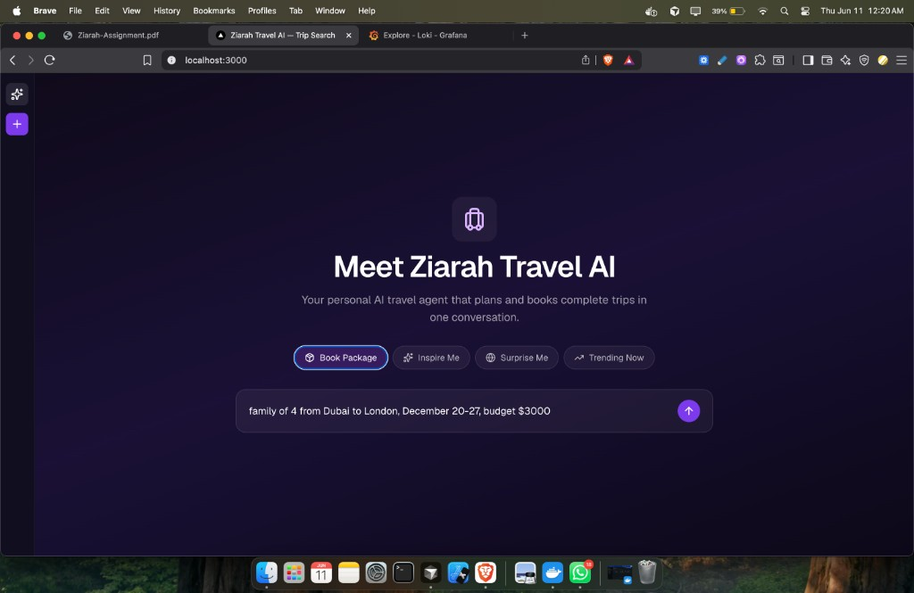
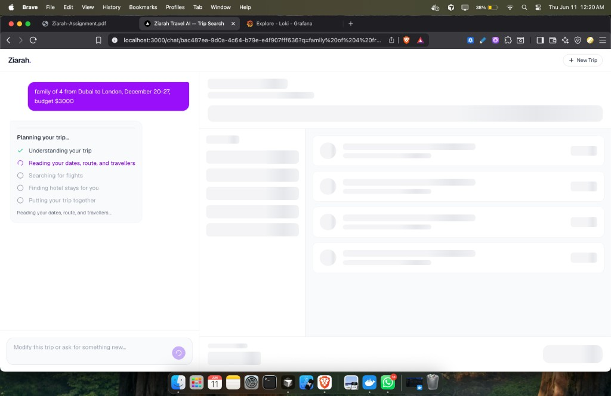
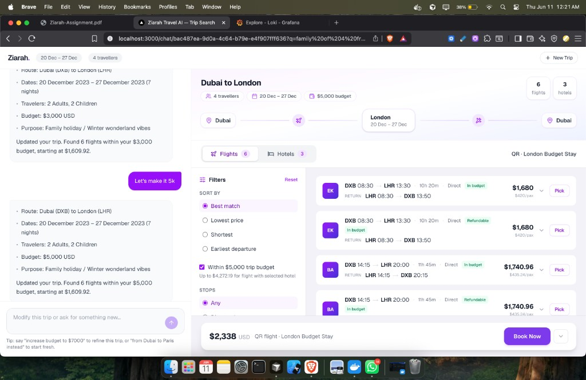
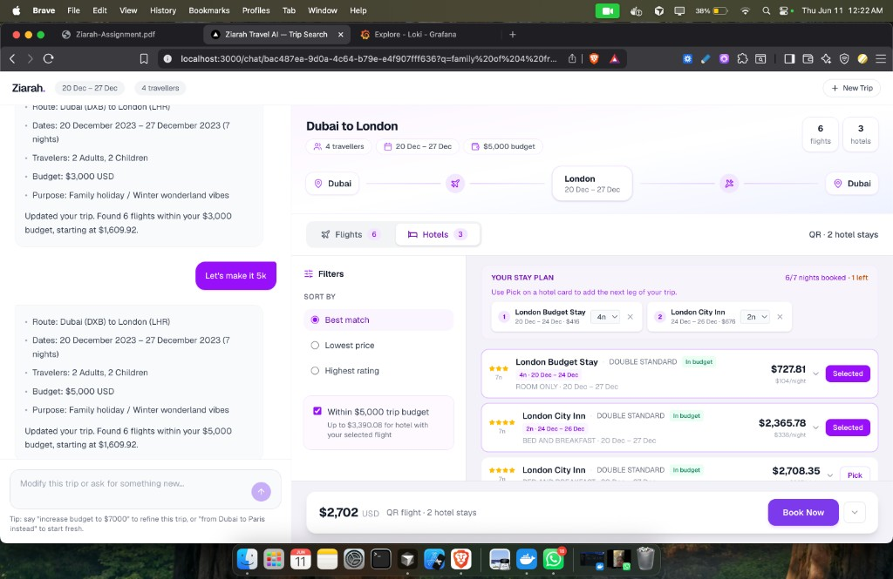

# Ziarah Trip Search

Assessment deliverable for [Ziarah.ai](https://ziarah.ai): natural-language trip search that calls Sabre, Amadeus, and HotelBeds in parallel, normalizes the results, and returns ranked flights and hotels for the chat UI.

**How it works (short version):**

1. User describes a trip in the chat UI.
2. The app parses the text into structured search parameters (dates, cities, budget, passengers).
3. Three providers are queried at the same time.
4. Results stream back to the UI as each provider finishes.
5. Offers are ranked and filtered against the trip budget.

Architecture, API contract, resilience, and deployment notes: [`design-docs/`](design-docs/) — start with [system-design.md](design-docs/system-design.md).

---

## UI walkthrough

Natural-language trip search from landing page through streamed results. Example query used throughout:

> family of 4 from Dubai to London, December 20-27, budget $3000

**Landing** — quick-start chips and a single prompt to describe the whole trip.



**Planning** — the chat workspace streams progress as the orchestrator parses the query and fans out to providers. Processing steps update live while results load.



**Flights** — ranked offers with route timeline, sort/filter controls, trip-level budget toggle, and a running total in the footer. Follow-up messages (e.g. "Let's make it 5k") refine the search in place.



**Hotels** — multi-stay planner, per-night pricing, and budget headroom after the selected flight. Pick hotels across the trip; the footer tracks combined flight + stay cost.



---

## How to run it

### Docker Compose (fastest path)

Mock mode by default — no provider keys, no OpenAI key, Redis included:

```bash
docker compose up --build
```

### URLs (Docker Compose)

| Service | URL | Notes |
|---------|-----|-------|
| Trip search (UI) | [http://localhost:3000](http://localhost:3000) | Chat workspace — natural-language search |
| Health | [http://localhost:3000/api/health](http://localhost:3000/api/health) | Expect `redis: "ok"` |
| Trip search (sync) | `POST http://localhost:3000/api/trips/search` | JSON body `{ "query": "..." }` |
| Trip search (stream) | `POST http://localhost:3000/api/trips/search/stream` | SSE — used by the chat UI |
| Trip by ID | `GET http://localhost:3000/api/trips/{requestId}` | Cached result lookup |
| Grafana | [http://localhost:3001](http://localhost:3001) | `admin` / `admin` — override via `GRAFANA_ADMIN_*` in `.env` |
| Grafana dashboard | [http://localhost:3001/d/trip-search-logs/trip-search-logs](http://localhost:3001/d/trip-search-logs/trip-search-logs) | **Trip Search → Trip Search Logs** — filter by `requestId` |
| Loki | [http://localhost:3100](http://localhost:3100) | Log storage (Grafana queries it; Promtail ships app stdout) |
| Redis | `redis://localhost:6379` | Query cache, result store, refresh locks |

Port overrides: `HOST_PORT`, `GRAFANA_HOST_PORT`, `LOKI_HOST_PORT`, `REDIS_HOST_PORT` in `.env` (see `.env.example`).

**Debugging a request:** copy `X-Request-Id` from an API response header → paste it into the Grafana dashboard variable to see all logs for that search.

### Local development

Node 20+. Redis is required for query cache, result lookup, and distributed refresh locks.

```bash
npm install
cp .env.example .env
```

Redis (if you don't already have one):

```bash
docker run -d --name ziarah-redis -p 6379:6379 redis:7-alpine
```

```bash
npm run dev                        # development
npm run build && npm run start     # production binary locally
```

`.env` defaults to `MOCK_PROVIDERS=true` and `MOCK_LLM=true`. All tunables are documented in `.env.example`.

| Service | URL |
|---------|-----|
| Trip search (UI + API) | [http://localhost:3000](http://localhost:3000) |
| Health | [http://localhost:3000/api/health](http://localhost:3000/api/health) |
| Redis | `redis://localhost:6379` |

Grafana and Loki are not started in local-only mode — use Docker Compose for the log stack.

### Verify it works

**UI** — open the app and search:

> family of 4 from Dubai to London, December 20-27, budget $3000

**Sync API:**

```bash
curl -X POST http://localhost:3000/api/trips/search \
  -H "Content-Type: application/json" \
  -d '{"query":"family of 4 from Dubai to London, December 20-27, budget $3000"}'
```

**Stream API** (what the chat UI uses): `POST /api/trips/search/stream` — SSE events as each provider completes. See [api-contract.md](design-docs/api-contract.md).

**Tests:**

```bash
npm test
```

**Load tests** ([k6](https://k6.io/) — install locally, or use Docker against the Compose stack):

```bash
npm run loadtest:smoke        # quick sanity check
npm run loadtest:sync         # p95 vs 3s SLO, ramp to 50 VUs
npm run loadtest:capacity     # step-ramp to ~100 VUs

# Docker — docker compose up first
npm run loadtest:docker:smoke
npm run loadtest:docker:sync
npm run loadtest:docker:capacity
```

See [load/README.md](load/README.md) for tuning and K8s-scale runs.

### Operating modes

| Mode | Config | When to use |
|------|--------|-------------|
| Mock everything | `MOCK_PROVIDERS=true`, `MOCK_LLM=true` | CI, Docker demo, local dev without credentials |
| Live flights + hotels | `MOCK_PROVIDERS=false`, Sabre + HotelBeds keys in `.env` | Sandbox integration testing |
| Live LLM | `MOCK_LLM=false`, `OPENAI_API_KEY` set | Free-form queries the regex parser won't catch |

**What's live today:** Sabre BFM and HotelBeds availability can hit real sandboxes. Amadeus is mock-only in this assessment — enterprise onboarding is slow and Sabre already proves the GDS integration path. The Amadeus adapter slot exists; set `MOCK_AMADEUS=false` when credentials are available.

---

## Design trade-offs

**Modular monolith over microservices.** The bottleneck is GDS and HotelBeds latency, not CPU. Splitting parse, fan-out, and normalize into separate services adds network hops inside a 3s p95 budget. One Next.js image, clear module boundaries under `src/lib/`, horizontal scale via pod count. A separate provider gateway would only make sense when credential management and rate limiting outgrow a single module.

**2-of-3 quorum.** Every search calls three providers (Sabre, Amadeus, HotelBeds). At least two must respond successfully, or the API returns HTTP 503. This gives redundancy on the flight side (two GDSs) while still allowing partial success — e.g. Sabre + Amadeus OK but HotelBeds down returns flights with `partialResults: true`, not a hard error. Only 0 or 1 providers succeeding triggers 503.

**One quorum retry on provider calls.** If fewer than 2 of 3 succeed on the first fan-out, only the failed providers are retried once (1s cap by default). Still bounded by the 3s sync global timeout. Circuit breaker (3 failures → 30s open) and client/cache retry cover longer outages.

**SSE-first, sync second.** The chat UI streams `provider` and `offers_update` events so users see results land instead of waiting on the slowest GDS. The sync route exists for tests and simple clients; it wraps the same pipeline with a global timeout.

**Mock LLM by default.** Regex + deterministic parser keeps CI and Docker reproducible without OpenAI spend. Production path is OpenAI structured output with regex fallback — set `MOCK_LLM=false` when you have a key.

**Provider-native mocks.** Mock payloads mirror real Sabre/Amadeus/HotelBeds response shapes so normalization tests catch field-mapping bugs without sandbox quota. Trade-off: larger seed files, optional Mockaroo regeneration.

**Redis from day one.** An in-memory `Map` works for single-pod dev, but multi-replica production needs shared query cache, result store, and refresh locks. Redis is a hard dependency in Compose and the K8s design.

**Trip-level budget.** Users say "$3000 for the trip," not "$1500 flights, $1500 hotels." Filtering happens after ranking across both verticals. Per-vertical caps from one number aren't supported in v1.

---

## Future improvements

Ordered by priority if this were going to production.

**1. Finish the integration surface**

- Live Amadeus OAuth + flight search (parity with Sabre adapter)
- Token refresh and credential rotation for all providers
- Booking path: HotelBeds CheckRate, Sabre revalidate — search-only is done; ticketing is not

**2. Observability before scale**

- OpenTelemetry: root span `trip.search`, children for `llm.parse`, each `provider.*`, `normalize`, `rank` — correlate on `requestId`
- Prometheus: `trip_search_duration_ms`, `provider_duration_ms`, quorum failure rate, breaker state, cache hit ratio
- Load test to validate 10k concurrent / 3s p95 — math in [kubernetes.md](design-docs/kubernetes.md); evidence still needed

**3. Resilience gaps**

- Stale hotel cache fallback when HotelBeds is down — serve last-known inventory with a freshness banner instead of flights-only partial results
- Configurable quorum (e.g. flights-only with explicit user opt-in)
- Rate limiting and API key auth on public endpoints

**4. Product expansion**

- Activity and transfer providers
- Redis-backed chat session history — multi-turn context is client-held today
- Provider health dashboard for ops

**5. Test depth**

- Contract tests against provider sandbox schemas
- E2E for the SSE stream and chat workspace
- Split services only if the monolith actually hurts — not preemptively

---

## Further reading

| Topic | Doc |
|-------|-----|
| System design | [system-design.md](design-docs/system-design.md) |
| Module layout, cache layers | [architecture.md](design-docs/architecture.md) |
| Request/response types, SSE events | [api-contract.md](design-docs/api-contract.md) |
| Timeouts, quorum, breakers | [resilience.md](design-docs/resilience.md) |
| Logs today, metrics/traces roadmap | [observability.md](design-docs/observability.md) |
| K8s manifests, HPA, Redis | [kubernetes.md](design-docs/kubernetes.md) |
