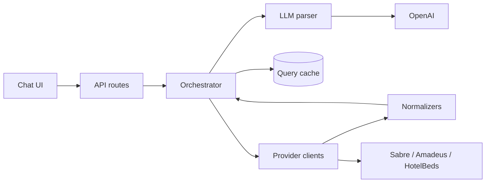

# Ziarah Trip Search — System Design

**Author:** Engineering  
**Last updated:** June 2026  
**Stack:** Next.js 16 (App Router), TypeScript, Zod, standalone Docker image

---

## What we're building

Ziarah users describe trips in plain language. This service parses that into structured search params, fans out to flight and hotel providers in parallel, normalizes the responses, ranks them, and returns a single payload the chat UI can render.

**Providers today**

| Provider | Vertical | Integration |
|----------|----------|-------------|
| Sabre | Flights | BFM (live + mock) |
| Amadeus | Flights | Mock only; live creds not wired yet |
| HotelBeds | Hotels | Availability API (live + mock) |

HotelBeds is a bedbank, not a GDS. We run three provider calls per search and require at least two to succeed before returning 200.

**Targets**

- p95 end-to-end under 3s for cache misses
- 10k concurrent users at peak (horizontal scale, not vertical)
- Stateless pods; shared cache moves to Redis before multi-replica prod

---

## Architecture



**Request path (stream route, which the UI uses):**

1. `POST /api/trips/search/stream` validates the body (Zod).
2. Orchestrator parses the query via OpenAI (regex fallback if no key or `MOCK_LLM=true`).
3. Cache lookup on a SHA-256 key of normalized params. Fresh hit returns immediately; stale hit returns cached data and refreshes in the background.
4. On miss: Sabre, Amadeus, and HotelBeds run in parallel, each behind a per-provider timeout and circuit breaker.
5. Each completion normalizes offers and pushes an SSE `provider` + `offers_update` event.
6. Orchestrator ranks, applies trip-level budget filter, checks quorum (≥2/3), writes cache, emits `complete`.

Sync route (`POST /api/trips/search`) is the same pipeline wrapped in a global timeout. Useful for tests and simple clients; the product UI should use SSE.

---

## Why a monolith

One Next.js deployable with clear module boundaries under `src/lib/`. At our scale the bottleneck is waiting on GDS and HotelBeds, not CPU. Splitting into microservices adds network hops inside a 3s budget without buying much.

**Module map**

| Area | Path | Owns |
|------|------|------|
| HTTP | `src/app/api/` | Validation, status codes, SSE framing |
| Orchestration | `src/lib/orchestration/` | Parse → cache → fan-out → rank → quorum |
| LLM | `src/lib/llm/` | OpenAI structured parse, regex fallback |
| Providers | `src/lib/providers/` | Auth, live/mock clients, breaker wrapper |
| Normalization | `src/lib/normalization/` | Provider JSON → unified offer types |
| Storage | `src/lib/storage/` | In-memory cache + result store (Redis in prod) |
| Resilience | `src/lib/resilience/` | `withTimeout`, `CircuitBreaker` |

**When I'd split something out**

- **Provider gateway** if we add more GDSs and credential/rate-limit logic gets messy.
- **LLM service** if we run custom models or need GPU nodes separate from search pods.
- **Booking service** when we add ticketing/PCI scope. Out of scope for search-only.

Until then, one image, one deployment, one health check.

---

## API surface

| Method | Path | Notes |
|--------|------|-------|
| `POST` | `/api/trips/search` | JSON response, global timeout |
| `POST` | `/api/trips/search/stream` | SSE; preferred for UI |
| `GET` | `/api/trips/{id}` | Cached result by `requestId` |
| `GET` | `/api/health` | Liveness/readiness |

Optional `X-Request-Id` (UUID v4) on requests; echoed on SSE responses along with `X-Duration-Ms`.

**Request body**

```json
{
  "query": "family of 4 Dubai to London Dec 20-27 under $3000",
  "context": null
}
```

`context` carries a prior `TripSearchParams` for modify flows. `query` is 3–2000 chars.

**Response shape (abbreviated)**

```json
{
  "requestId": "550e8400-e29b-41d4-a716-446655440000",
  "parsedQuery": { },
  "meta": {
    "durationMs": 1842,
    "providersQueried": 3,
    "providersSucceeded": 3,
    "providersFailed": 0,
    "partialResults": false,
    "cache": { "status": "miss", "ttlMs": 300000 }
  },
  "providers": { },
  "flights": { "totalOffers": 80, "truncated": true, "offers": [] },
  "hotels": { "totalOffers": 25, "offers": [] },
  "tripSummary": {
    "cheapestFlight": 890,
    "cheapestHotel": 1200,
    "estimatedTripTotal": 2090,
    "currency": "USD",
    "withinBudget": true
  }
}
```

Raw provider payloads never leave the server. Client gets `PublicFlightOffer` / `PublicHotelOffer` (caps: 50 flights, 30 hotels, env-configurable).

**SSE events:** `status`, `parsed`, `provider`, `offers_update`, `complete`, `error`. Full schemas in [api-contract.md](./api-contract.md).

**Errors**

| Code | When |
|------|------|
| 400 | Bad request body |
| 422 | Couldn't parse the query |
| 503 | Fewer than 2 providers succeeded |
| 504 | Sync route global timeout |
| 500 | Unexpected |

---

## Failure handling

We optimize for predictable latency over heroic recovery.

| Mechanism | Setting | Why |
|-----------|---------|-----|
| Per-provider timeout | 2.5s (`PROVIDER_TIMEOUT_MS`) | Slow GDS can't hold the whole search |
| Global timeout | 3s prod (`GLOBAL_TIMEOUT_MS`), sync only | Hard ceiling for non-stream clients |
| Circuit breaker | 3 failures → open 30s, per provider | Stop hammering a dead upstream |
| Quorum | 2 of 3 must succeed | Need flights from at least one GDS plus hotels, or equivalent via cache |
| Provider isolation | Separate try/catch per call | One failure doesn't cancel the others |

**No retries on GDS calls.** A retry inside the same request usually blows the 3s budget. If the client retries the whole search, stale-while-revalidate may already have warmed the cache.

**LLM fallback:** OpenAI → contextual modify (if `context` set) → regex mock parser.

**Partial success:** 2/3 providers OK → HTTP 200, `meta.partialResults: true`. 0–1/3 → 503.

Mock mode supports chaos testing: origin `ZZZ` kills flight providers, `destinationCode: "FAIL"` kills HotelBeds. Details in [resilience.md](./resilience.md).

---

## Observability

**Shipped now:** `console.error` on quorum/search failures, `GET /api/health`, `X-Request-Id` and `X-Duration-Ms` on SSE.

**Not shipped yet (but planned before prod):**

- OpenTelemetry traces: root span `trip.search`, children for `llm.parse`, each `provider.*`, `normalize`, `rank`
- Prometheus metrics: `trip_search_duration_ms`, `provider_duration_ms`, `quorum_failures_total`, `circuit_breaker_state`, cache hit ratio
- Structured logging (pino) with `requestId` on every line; no query text or secrets in logs

**Alerts I'd actually page on:** p95 > 3s for 5 min, 503 rate > 5%, any circuit breaker open > 2 min.

More detail: [observability.md](./observability.md).

---

## Deployment

Stateless pods behind an ingress (ALB or equivalent). ConfigMap for timeouts/TTL/model name; Secrets for provider keys and `REDIS_URL`.

**Scaling back-of-envelope for 10k concurrent users**

Search is I/O-bound. Assume ~250 in-flight requests per pod at ~2s average duration → ~40 pods at peak. HPA min 4, max 40; CPU target 60% plus a custom `http_inflight_requests` metric if we wire it up.

Probes hit `GET /api/health`. Rolling update with `maxUnavailable: 0` so we don't drain capacity mid-deploy.

**Redis cutover:** In-memory `Map` caches work for single-pod dev. Multi-replica prod needs Redis for query cache, `requestId` → result lookup, and distributed refresh locks. Pod restart loses in-memory state; that's acceptable until Redis is live.

Manifests and env split: [kubernetes.md](./kubernetes.md).

---

## Latency budget

| Phase | Budget |
|-------|--------|
| LLM parse | ~800ms |
| Provider fan-out (parallel) | ~1500ms p95 |
| Normalize + rank | ~50ms |
| Ingress | ~20ms |
| **Total (miss)** | **< 3s p95** |
| Cache hit | < 100ms |

---

## Decisions worth noting

1. **HotelBeds for hotels** — matches how Ziarah actually distributes hotel inventory.
2. **2-of-3 quorum** — two flight GDSs are redundant; hotels depend on HotelBeds unless we have a stale cache entry with hotel data.
3. **SSE-first** — users see provider results as they land instead of staring at a spinner for 3s.
4. **Trip-level budget** — filter applied after ranking across flights + hotels, not per vertical.
5. **Provider-native mocks** — normalization is tested against realistic payloads without live API spend.

---

## Further reading

| Topic | Doc |
|-------|-----|
| Module boundaries, cache layers | [architecture.md](./architecture.md) |
| Full API types | [api-contract.md](./api-contract.md) |
| Breakers, timeouts, quorum edge cases | [resilience.md](./resilience.md) |
| Metrics, logs, dashboards | [observability.md](./observability.md) |
| K8s YAML, HPA, Redis keys | [kubernetes.md](./kubernetes.md) |
