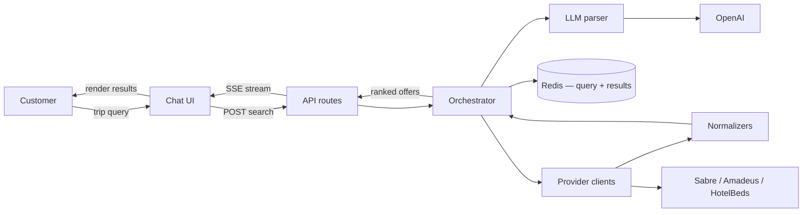

# Ziarah Trip Search — System Design

**Author:** Engineering  
**Last updated:** June 2026  
**Stack:** Next.js 16 (App Router), TypeScript, Zod, standalone Docker image

---

## What this is

Ziarah users describe trips in plain language. This service:

1. Parses the text into structured search parameters (origin, dates, passengers, budget).
2. Calls Sabre, Amadeus, and HotelBeds **in parallel**.
3. Normalizes each provider's response into a common offer format.
4. Ranks offers and applies the trip-level budget filter.
5. Returns a single payload the chat UI can render.

**Providers**

| Provider | What it sells | Integration status |
|----------|---------------|-------------------|
| Sabre | Flights | BFM — live sandbox + mock |
| Amadeus | Flights | Mock by default; live adapter behind `MOCK_AMADEUS=false` |
| HotelBeds | Hotels | Availability API — live sandbox + mock |

HotelBeds is a bedbank (hotel wholesaler), not a GDS. All three are called on every search. **Quorum rule:** at least 2 of 3 must respond successfully, or the API returns HTTP 503. See [resilience.md](./resilience.md) for examples.

**Performance targets**

| Target | Value | Notes |
|--------|-------|-------|
| p95 latency (cache miss) | &lt; 3s | Measured on sync route; stream has no global cap |
| Peak in-flight searches | 10k | This module only — see scaling math in [kubernetes.md](./kubernetes.md) |
| Pod model | Stateless | Shared state lives in Redis (cache, results, locks) |

The 10k figure is **concurrent open searches**, not total app users. Most users browsing results aren't actively searching — at 8–15% active-search ratio, 10k in-flight searches ≈ 67k–125k concurrent app users.

---

## Architecture



**Request path (stream route — what the UI uses):**

1. `POST /api/trips/search/stream` validates the body (Zod).
2. Orchestrator parses the query via OpenAI (regex fallback if no key or `MOCK_LLM=true`).
3. Cache lookup on a SHA-256 key of normalized params. Fresh hit → return immediately. Stale hit → return cached data and refresh in the background.
4. On cache miss: Sabre, Amadeus, and HotelBeds run in parallel, each behind a per-provider timeout and circuit breaker.
5. Each completion normalizes offers and pushes an SSE `provider` + `offers_update` event.
6. If fewer than 2 of 3 succeed, retry **only failed providers once** (`PROVIDER_RETRY_TIMEOUT_MS`, default 1s). Stream emits `"Retrying unavailable providers..."` plus additional `provider` / `offers_update` events.
7. Orchestrator ranks, applies trip-level budget filter, checks quorum (≥2/3), writes cache, emits `complete`.

The sync route (`POST /api/trips/search`) runs the same pipeline but returns one JSON body and enforces a global timeout. Use it for tests and simple clients; the product UI should use SSE.

---

## Monolith

One Next.js deployable with module boundaries under `src/lib/`. The bottleneck is GDS and HotelBeds latency, not CPU — splitting into microservices adds network hops inside a 3s budget without improving throughput.

**Module map**

| Area | Path | Owns |
|------|------|------|
| HTTP | `src/app/api/` | Validation, status codes, SSE framing |
| Orchestration | `src/lib/orchestration/` | Parse → cache → fan-out → quorum retry → rank → quorum |
| LLM | `src/lib/llm/` | OpenAI structured parse, regex fallback |
| Providers | `src/lib/providers/` | Auth, live/mock clients, breaker wrapper |
| Normalization | `src/lib/normalization/` | Provider JSON → unified offer types |
| Storage | `src/lib/storage/` | Redis client, query cache, result store, refresh locks |
| Observability | `src/lib/observability/` | pino structured logging (metrics/traces: planned — see [observability.md](./observability.md)) |
| Resilience | `src/lib/resilience/` | `withTimeout`, `CircuitBreaker` |

**Future extraction boundaries** (defined, not built): provider gateway for multi-GDS credential and rate-limit management; LLM service for self-hosted models; booking service for ticketing/PCI. Search runs as one image, one deployment, one health check today.

---

## API surface

| Method | Path | Notes |
|--------|------|-------|
| `POST` | `/api/trips/search` | JSON response, global timeout |
| `POST` | `/api/trips/search/stream` | SSE; preferred for UI |
| `GET` | `/api/trips/{id}` | Cached result by `requestId` |
| `GET` | `/api/health` | Liveness/readiness |

Optional `X-Request-Id` (UUID v4) on requests; echoed on SSE responses along with `X-Duration-Ms`.

**Request body**

```json
{
  "query": "family of 4 Dubai to London Dec 20-27 under $3000",
  "context": null
}
```

`context` carries a prior `TripSearchParams` for follow-up modify flows (e.g. "increase budget to $5000"). `query` is 3–2000 chars.

**Response shape (abbreviated)**

```json
{
  "requestId": "550e8400-e29b-41d4-a716-446655440000",
  "parsedQuery": { },
  "meta": {
    "durationMs": 1842,
    "providersQueried": 3,
    "providersSucceeded": 3,
    "providersFailed": 0,
    "partialResults": false,
    "cache": { "status": "miss", "ttlMs": 300000 }
  },
  "providers": { },
  "flights": { "totalOffers": 80, "truncated": true, "offers": [] },
  "hotels": { "totalOffers": 25, "offers": [] },
  "tripSummary": {
    "cheapestFlight": 890,
    "cheapestHotel": 1200,
    "estimatedTripTotal": 2090,
    "currency": "USD",
    "withinBudget": true
  }
}
```

Raw provider payloads never leave the server. The client gets `PublicFlightOffer` / `PublicHotelOffer` (caps: 50 flights, 30 hotels, env-configurable).

**SSE events:** `status`, `parsed`, `provider`, `offers_update`, `complete`, `error`. Full schemas in [api-contract.md](./api-contract.md).

**Errors**

| Code | When |
|------|------|
| 400 | Bad request body |
| 422 | Couldn't parse the query |
| 503 | Fewer than 2 providers succeeded after quorum retry |
| 504 | Sync route global timeout (may occur during retry) |
| 500 | Unexpected |

---

## Failure handling

The system optimizes for predictable latency over unbounded retries.

| Mechanism | Setting | Why |
|-----------|---------|-----|
| Per-provider timeout | 2.5s (`PROVIDER_TIMEOUT_MS`) | A slow GDS can't block the whole search on attempt 1 |
| Quorum retry timeout | 1s (`PROVIDER_RETRY_TIMEOUT_MS`) | Shorter cap on attempt 2 for failed providers only |
| Global timeout | 3s prod (`GLOBAL_TIMEOUT_MS`), sync only | Hard ceiling for non-stream clients (includes retry) |
| Circuit breaker | 3 failures → open 30s, per provider | Stop hammering a dead upstream |
| Quorum | 2 of 3 must succeed | Simple count — not a per-vertical requirement |
| Quorum retry | One round, failed providers only | Recover transient blips without a full client re-search |
| Provider isolation | Separate try/catch per call | One failure doesn't cancel the others |

**Quorum outcomes (after retry, if enabled):**

| Providers succeeded | HTTP | `partialResults` | Example |
|--------------------|------|------------------|---------|
| 3/3 | 200 | false | All good |
| 2/3 | 200 | true | HotelBeds down → flights only |
| 0–1/3 | 503 | n/a | Two or more providers failed |

Disable quorum retry with `PROVIDER_QUORUM_RETRY=false`. Details: [resilience.md](./resilience.md).

**LLM fallback:** OpenAI → contextual modify (if `context` set) → regex mock parser. Sync route caps the first OpenAI attempt at `SYNC_LLM_PARSE_TIMEOUT_MS` (800ms) so provider fan-out fits the 3s global budget; stream uses full `LLM_PARSE_TIMEOUT_MS`.

Mock mode supports chaos testing: origin `ZZZ` (or city `fail`) kills flight providers, `destinationCode: "FAIL"` kills HotelBeds. Details in [resilience.md](./resilience.md).

---

## Observability

### Implemented today

- **Structured logging (pino)** — JSON to stdout, keyed on `requestId` + `route`. Events: search lifecycle, provider results, quorum retry, quorum failures, LLM parse/fallback, Redis errors.
- **Log aggregation (Docker Compose)** — Promtail → Loki → Grafana with a Trip Search Logs dashboard. Filter by `requestId`.
- **Health** — `GET /api/health` includes Redis ping; returns 503 when Redis is down.
- **Correlation** — `X-Request-Id` and `X-Duration-Ms` on SSE responses.

### Planned for production

- **Metrics** — Prometheus scrape on `/api/metrics`: search duration, per-provider latency, quorum failures, breaker state, cache hit ratio.
- **Tracing** — OpenTelemetry span tree rooted at `trip.search`.
- **Alerts** — p95 > 3s for 5 min, 503 rate > 5%, circuit breaker open > 2 min, Redis unreachable > 1 min.

**Load validation:** k6 scripts in `load/` — smoke, sync SLO (p95 < 3s), stream, and step-ramp capacity. See [load/README.md](../load/README.md).

Full detail: [observability.md](./observability.md).

---

## Deployment

Stateless pods behind an ingress (ALB or equivalent). ConfigMap for timeouts/TTL/model name; Secrets for provider keys and `REDIS_URL`.

**Scaling model — 10k in-flight searches**

This module only — not total app concurrency. Search is I/O-bound (waiting on providers), so capacity is driven by concurrent open requests, not CPU.

Rough math: ~100 in-flight requests per pod at ~2s average duration → ~100 pods at peak. HPA min 4, max 100. Per-pod ceiling is measured with `load/capacity.js`. See [kubernetes.md](./kubernetes.md) for the full model and example YAML.

Probes hit `GET /api/health` (readiness fails when Redis is unreachable). Rolling update with `maxUnavailable: 0` so capacity doesn't drop mid-deploy.

**Redis:** Query cache (`trip:cache:*`), result store (`trip:result:*`, 1h TTL), and stale-refresh locks (`trip:lock:*`) all live in Redis. Pods are stateless; cache survives restarts and is shared across replicas. If Redis is down, searches still work but lose cache hits and cross-pod `GET /api/trips/{id}`.

Manifests and env split: [kubernetes.md](./kubernetes.md).

---

## Latency budget

| Phase | Budget |
|-------|--------|
| LLM parse | ~800ms |
| Provider fan-out (parallel, attempt 1) | ~1500ms p95 |
| Quorum retry (optional, attempt 2) | up to ~1000ms per failed provider |
| Normalize + rank | ~50ms |
| Ingress | ~20ms |
| **Total (miss, no retry)** | **< 3s p95** |
| **Total (miss + retry)** | may exceed 3s on stream; sync capped by `GLOBAL_TIMEOUT_MS` |
| Cache hit | < 100ms |

---

## Key decisions

1. **HotelBeds for hotels** — matches how Ziarah distributes hotel inventory.
2. **2-of-3 quorum** — simple provider-count rule; 2/3 success returns 200 even if one vertical is empty.
3. **One quorum retry** — when attempt 1 misses quorum, only failed providers get a single shorter retry; no retry loop.
4. **SSE-first** — users see provider results as they land instead of waiting for the slowest GDS.
5. **Trip-level budget** — filter applied after ranking across flights + hotels, not per vertical.
6. **Provider-native mocks** — normalization tested against realistic payloads without live API spend.

---

## Further reading

| Topic | Doc |
|-------|-----|
| Module boundaries, cache layers | [architecture.md](./architecture.md) |
| Full API types | [api-contract.md](./api-contract.md) |
| Breakers, timeouts, quorum edge cases | [resilience.md](./resilience.md) |
| Logs today, metrics/traces roadmap | [observability.md](./observability.md) |
| K8s YAML, HPA, Redis keys | [kubernetes.md](./kubernetes.md) |
